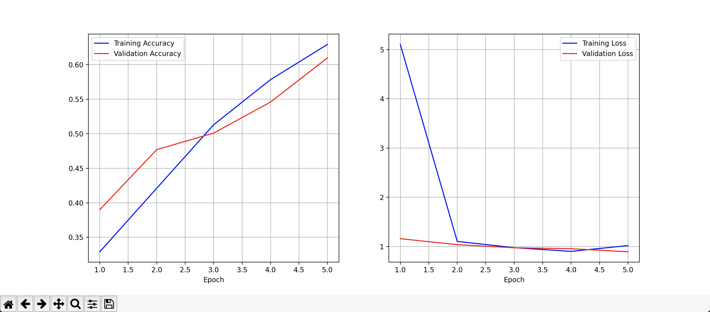

## Initial Network


## Employing Hyper-parameter optimization

### Strategy

```
_________________________________________________________________
 Layer (type)                Output Shape              Param #   
=================================================================
 conv2d (Conv2D)             (None, 148, 148, 8)       224       
                                                                 
 max_pooling2d (MaxPooling2D  (None, 74, 74, 8)        0         
 )                                                               
                                                                 
 conv2d_1 (Conv2D)           (None, 72, 72, 16)        1168      
                                                                 
 max_pooling2d_1 (MaxPooling  (None, 36, 36, 16)       0         
 2D)                                                             
                                                                 
 conv2d_2 (Conv2D)           (None, 34, 34, 32)        4640      
                                                                 
 max_pooling2d_2 (MaxPooling  (None, 17, 17, 32)       0         
 2D)                                                             
                                                                 
 flatten (Flatten)           (None, 9248)              0         
                                                                 
 dense (Dense)               (None, 32)                295968    
                                                                 
 dense_1 (Dense)             (None, 3)                 99        
                                                    
```
```
Total params: 302,099
Trainable params: 302,099
Non-trainable params: 0
```
```
Confusion Matrix for basic_model
[[999 605 170]
 [248 853 132]
 [109 194 528]]
```

In our hyperparameter optimization strategy, we tried to use the Dropoff layers after the Convolution and Pooling layer blocks to help improve the accuracy of both the training and validation accuracy. With an intial success with a dropoff value of `0.1` after training 6 epochs with accuracies of around 0.6, we decided to remove the dropoff for our network, and adjust the other parameters. We then observed that after increasing the number of epochs to 10 to 12, we could reach a bit above 0.7 for both the training and validation accuracies.